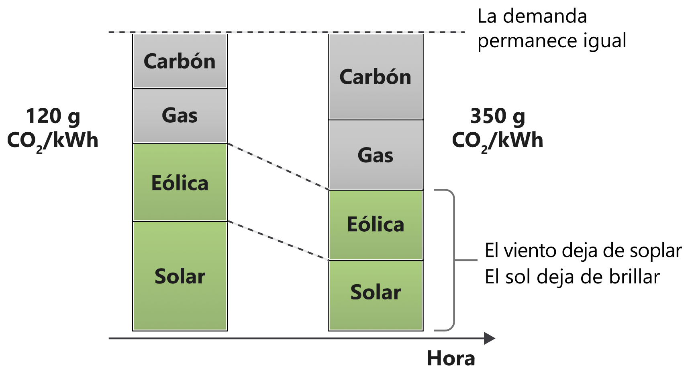
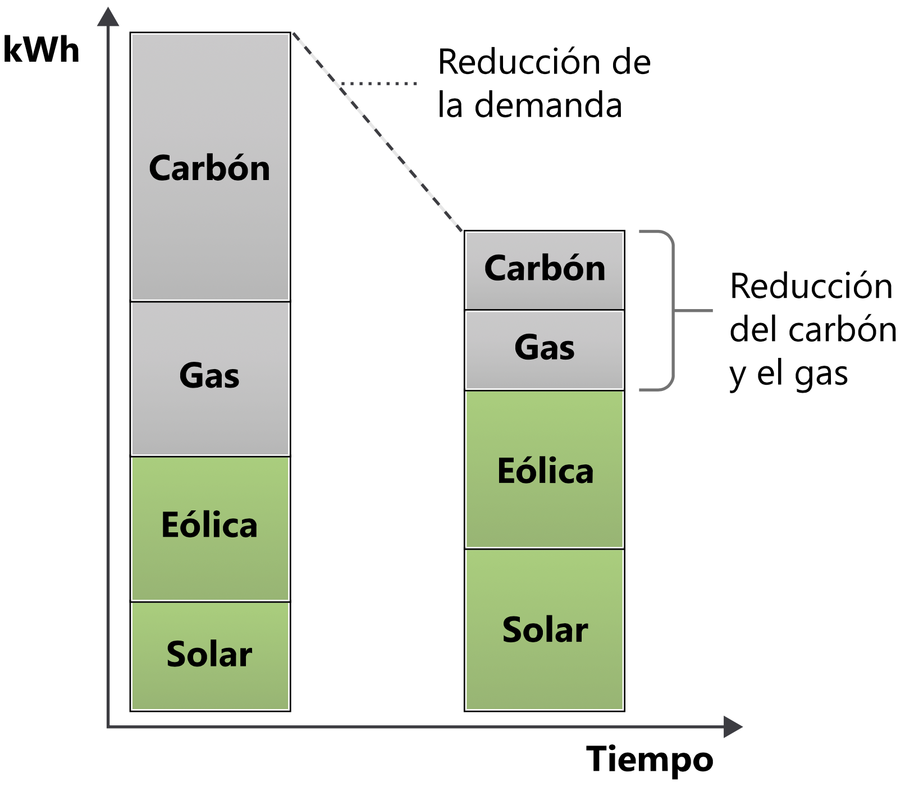
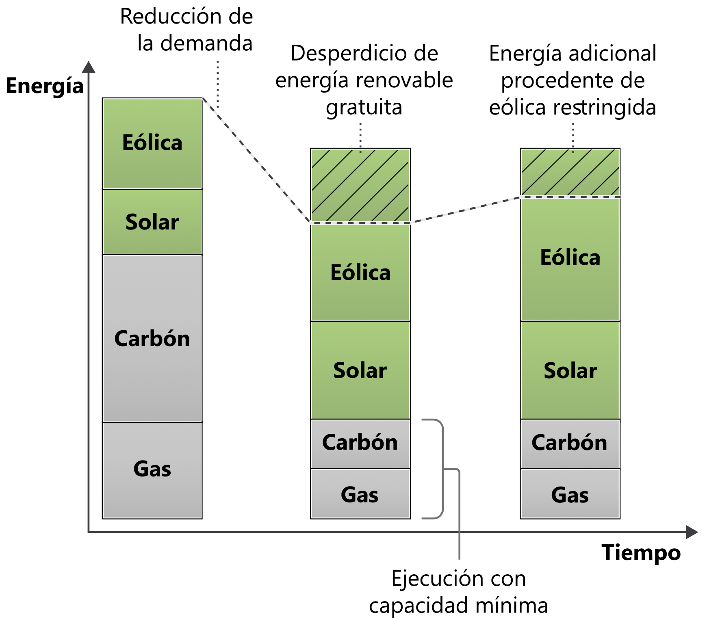
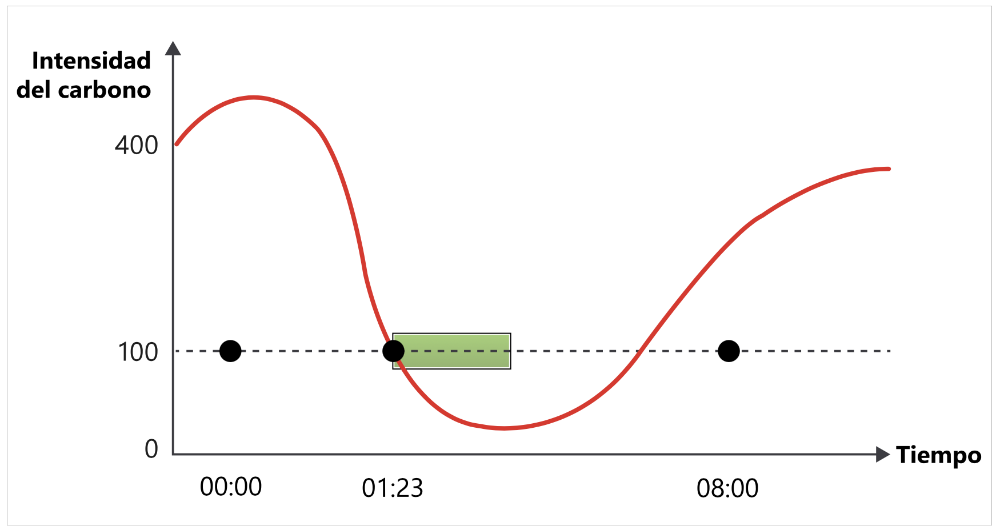

La intensidad del carbono de la electricidad es una medida de la cantidad de emisiones de carbono (CO2eq) generadas por kilovatio/hora de consumo eléctrico.

La unidad estándar de la intensidad del carbono es **gCO 2eq/kWh o gramos de carbono por kilovatio/hora**.

No toda la electricidad se genera de la misma manera. En función del momento y la ubicación, la electricidad se genera utilizando diversas fuentes con diferentes emisiones de carbono. Algunas fuentes, como las eólicas, las solares o las hidroeléctricas, son limpias y renovables, y no emiten carbono. Otras fuentes de combustible fósil emiten diferentes cantidades de carbono para generar electricidad. Por ejemplo, las centrales eléctricas alimentadas por gas emiten menos carbono que las alimentadas por carbón.

Si conectara el equipo directamente a una central hidroeléctrica, la electricidad que consumiría tendría una intensidad de carbono de **cero gCO 2eq/kWh**. Una central hidroeléctrica no emite carbono para generar esa electricidad. La mayoría de los usuarios no se pueden conectar directamente a centrales hidroeléctricas. En su lugar, se conectan a redes eléctricas a las que se les proporciona electricidad por medio de una combinación de fuentes que generan cantidades de carbono variables. Por tanto, cuando se conecta a una red, la intensidad del carbono suele ser superior a cero.

# Variabilidad de la intensidad del carbono

La intensidad del carbono cambia por ubicación, ya que algunas regiones tienen una combinación energética que contiene más fuentes de energías limpias que otras.

La intensidad del carbono también cambia con el tiempo debido a la naturaleza variable de la energía renovable. Por ejemplo, cuando está nublado o no sopla el viento, la intensidad del carbono aumenta debido a que la electricidad de la combinación proviene de orígenes que emiten carbono.

La demanda de electricidad varía durante el día, y esa demanda la debe satisfacer el suministro. Parte de ese suministro puede controlar con facilidad la potencia que genera; por ejemplo, una central eléctrica alimentada con carbón puede consumir menos carbón. Parte de ese suministro no puede controlar fácilmente la potencia que genera; por ejemplo, una granja eólica no puede controlar la velocidad del viento, solo puede descartar (reducir) electricidad que, básicamente, se ha generado de manera gratuita.

Como efecto secundario del funcionamiento de los mercados energéticos cuando se reduce la demanda de electricidad, por lo general, primero se escalan horizontalmente las fuentes de energía alimentadas mediante combustibles fósiles que más emiten y, luego, las renovables.

Si se reduce la cantidad de electricidad que consumen las aplicaciones, se puede reducir la intensidad del carbono de la combinación energética de las redes locales.

# Intensidad marginal del carbono

Si opta por consumir más energía, esa energía proviene de la central eléctrica marginal. Esa central eléctrica es la que puede controlar la energía que genera, mientras que las renovables no pueden controlar el sol o el viento, por lo que las centrales eléctricas marginales se suelen alimentar con combustibles fósiles.

La planta marginal emite carbono; en cualquier momento dado se cuenta con la intensidad del carbono de la combinación de energía de la red, pero también con la de la energía que se tendría que haber generado para satisfacer la nueva demanda, lo que se denomina intensidad del carbono marginal.

Las centrales eléctricas alimentadas mediante combustibles fósiles rara vez se escalan horizontalmente a cero; tienen un umbral de funcionamiento mínimo. Algunas no se escalan en absoluto, sino que se considera que tienen una carga básica coherente siempre activada. Por este motivo, a veces se llega al escenario perverso en el que se descarta (se reduce) la energía renovable que se ha generado de forma gratuita para consumir la energía de centrales eléctricas generada mediante un combustible sólido que cuesta dinero.

Si una carga nueva se completara con el suministro de una fuente renovable que de otro modo se habría reducido, la intensidad del carbono marginal sería **cero gCO 2eq/kWh**.

Hay momentos en los que la intensidad del carbono marginal de la electricidad es de **cero gCO 2eq/kWh**; si en ese momento se realizan cálculos, el resultado es que el consumo eléctrico **no emite carbono**.

# Desplazamiento de la demanda

Los sistemas de redes eléctricas actuales apenas cuentan con almacenamiento o almacenamiento en búfer. Normalmente, se genera electricidad para que el suministro siempre satisfaga la demanda. Si se genera más energía de la necesaria de fuentes renovables para admitir la demanda y todas las opciones de almacenamiento están llenas, esa energía limpia se reduce (se descarta). Una solución consiste en desplazar las cargas de trabajo a horas y ubicaciones donde haya mayor suministro de energía renovable, lo que se denomina desplazamiento de la demanda.

Si puede ser flexible con respecto a cuándo y dónde se ejecutan las cargas de trabajo, puede optar por consumir electricidad cuando la intensidad de carbono sea menor, y detenerse cuando sea alta. Por ejemplo, entrenar un modelo de Machine Learning a una hora o en una región donde la intensidad del carbono es mucho menor.

En estudios como [Putting a CO2 figure on a piece of computation](https://ieeexplore.ieee.org/document/6128960) (Incluir una cifra de CO2 en un cálculo) se ha demostrado que estas acciones pueden dar lugar a una reducción del carbono de entre el 45 % y el 99 %, según el número de renovables que alimenten la red.
Examine la aplicación de forma global, identifique las oportunidades para ser flexible con respecto a las cargas de trabajo y use la intensidad del carbono de la electricidad para indicar cuándo o si se deben ejecutar esas cargas de trabajo.

# Cálculo de la intensidad del carbono

Hay varios servicios que permiten obtener datos en tiempo real con respecto a la intensidad del carbono actual de distintas redes eléctricas. Algunos proporcionan estimaciones futuras de la intensidad del carbono, y otros, la intensidad del carbono marginal.

- [Carbon Intensity API](https://carbonintensity.org.uk): recurso gratuito para datos de la intensidad del carbono en el Reino Unido
- [ElectricityMap](https://api.electricitymap.org): gratuito para uso no comercial en un solo país; soluciones prémium para acceso comercial y en varios países
- [WattTime](https://www.watttime.org): gratuito para una región con una sola red, soluciones prémium para varias redes y emisiones marginales en tiempo real