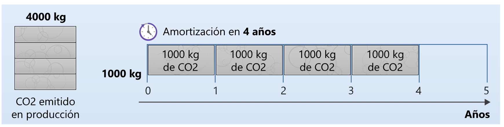
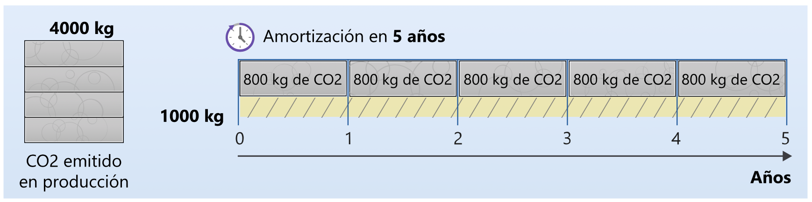

El dispositivo en el que está leyendo este documento ha emitido carbono al crearse; una vez que llegue al final del ciclo de vida, su eliminación puede liberar más. El carbono incorporado (que también se conoce como "carbono incrustado") es la cantidad de contaminación de carbono que se emite durante la creación y eliminación de un dispositivo. Al calcular la huella de carbono total de los equipos que ejecutan el software, tenga en cuenta la huella de carbono para ejecutar el equipo y el carbono incorporado en el equipo.

# El carbono incorporado es importante
En función de la intensidad de carbono de la combinación energética, el costo del carbono incorporado de un dispositivo puede ser elevado en comparación con el de la electricidad que lo alimenta.

Por ejemplo, un [servidor Dell R640 de 2019](https://i.dell.com/sites/csdocuments/CorpComm_Docs/en/carbon-footprint-poweredge-r640.pdf) tiene un costo de carbono incorporado amortizado de 320 kg de CO2eq/año. También se espera que consuma 1760,3 kWh/año de electricidad. La intensidad media del carbono en Europa era de 0,276 kg de CO2eq/kWh en 2019.

Por tanto, el costo total de carbono será de 320 + (0,276 * 1760,3) = 805 kg de carbono/año, de los cuales 320 kg (aproximadamente el 40 %) provienen del carbono incorporado. El carbono incorporado es un factor que contribuye de forma significativa a la emisión total de carbono de los servidores.

> El costo del carbono incorporado suele ser mucho más alto para los dispositivos personales, en ocasiones más que el costo del carbono total del consumo eléctrico. Para obtener un ejemplo, vea [Smartphones Are Killing The Planet Faster Than Anyone Expected](https://www.fastcompany.com/90165365/smartphones-are-wrecking-the-planet-faster-than-anyone-expected) (Los smartphones están acabando con el planeta más rápidamente de lo que se esperaba).

# No desperdicie el hardware
Cuando compra un equipo, ya ha emitido una carga completa de carbono. Los equipos también tienen una fecha de expiración, envejecen, no pueden administrar las cargas de trabajo modernas y es necesario actualizarlos. Si lo piensa de esta manera, el hardware es un indicador representativo del carbono, por lo que, como ingeniero de software sostenible, la eficiencia del hardware debe ser muy elevada si el objetivo es la eficiencia en el uso del carbono.

Puede hacer muchas cosas para que el hardware sea eficiente, como facilitar la extensión de su fecha de expiración. Los equipos no se desgastan, no tienen piezas móviles, simplemente se quedan obsoletos. Se vuelven obsoletos porque continuamente se crea software que fuerza los límites.

# Ampliación de la duración del hardware

Una manera de tener en cuenta el carbono incorporado consiste en amortizar el carbono durante el intervalo de vida esperado de un dispositivo. Por ejemplo, si se han necesitado 4000 kg de carbono para crear un servidor hipotético y se esperaba que durara cuatro años, esto se puede considerar equivalente a la emisión de 1000 kg de carbono al año durante su vida útil.

Si el carbono incorporado se aborda de esta manera, cualquier dispositivo, incluso uno que no consuma electricidad, emite carbono mientras dure. Teniendo esto en cuenta, si se amortizaran los mismos 4000 kg de carbono en el servidor hipotético durante cinco años en lugar de cuatro, el carbono emitido por año se reduciría a 800 kg.

Si se aplica este concepto a la vida útil del servidor Dell R640 de 2019 que se ha mencionado antes, el carbono amortizado se reduciría de **320 kg de CO 2eq/año a 256 kg de CO 2eq/año** si se ampliara su vida útil a cinco años en lugar de cuatro.

El hardware se retira porque se estropea o tiene dificultades para administrar cargas de trabajo modernas. El software no puede ayudar con el primer factor, pero, si se centra en crear aplicaciones que se puedan ejecutar en hardware más antiguo, se puede ayudar con el segundo.